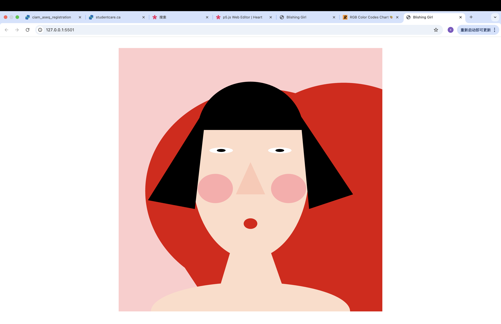

<title>Blishing Girl</title>
AUTHOR NAME:  xueyi

[View this project online] GitHub Pages Link : https://github.com/xiaxueyi00-eng/cart253/tree/main/air-jam

## Description
This project creates a humorous self-portrait using p5.js.
 It combines ideas discussed in class with experiments using recently learned functions.
 The face has a heart-shaped background and is made up of basic geometric shapes like triangles, quads, ellipses, and arcs.

How to interact
- Mouth: You can move the mouse up or down to adjust the height of the mouth, and left or right to make it wider. 
-  Eyes: The eyes produce a lively and natural expression by blinking on their own every few seconds. 
 
- Heart background: Use the mouse wheel to dynamically enlarge or contract the heart.

Features
- Blush: A gentle animated gradient is produced by utilizing lerpColor() to gradually change the cheeks' color. 
- Hair: The bangs and side hair that frame the face are a combination of arcs, triangles, and semicircles. - Nose, neck, and shoulders: The portrait is finished with a small triangular nose, a quad for the neck, and an ellipse for the shoulders.

Experience

Overall, this project is meant to give the viewer a playful and interactive experience, showing how simple code and geometric shapes can come together to form a lively, cartoon-like character.

## Screenshot(s)

This bit should have some images of the program running so that the reader has a sense of what it looks like. 

## Attribution

This bit should attribute any code, assets or other elements used taken from other sources. For example:

> - This project uses [p5.js](https://p5js.org).
> - The Week 3 group assignment inspired the blinking eyes concept (using frameCount with conditionals).
> - Using `scale()` and `mouseWheel()`, dynamic resizing was added to the heart shape, which was inspired by basic geometric combinations (two circles and one triangle). 
> - Usine `lerpColor()` from [p5.js](https://p5js.org).

This bit should include the license you want to apply to your work. 

> This project is licensed under a Creative Commons Attribution ([CC BY 4.0](https://creativecommons.org/licenses/by/4.0/deed.en)) license with the exception of libraries and other components with their own licenses.