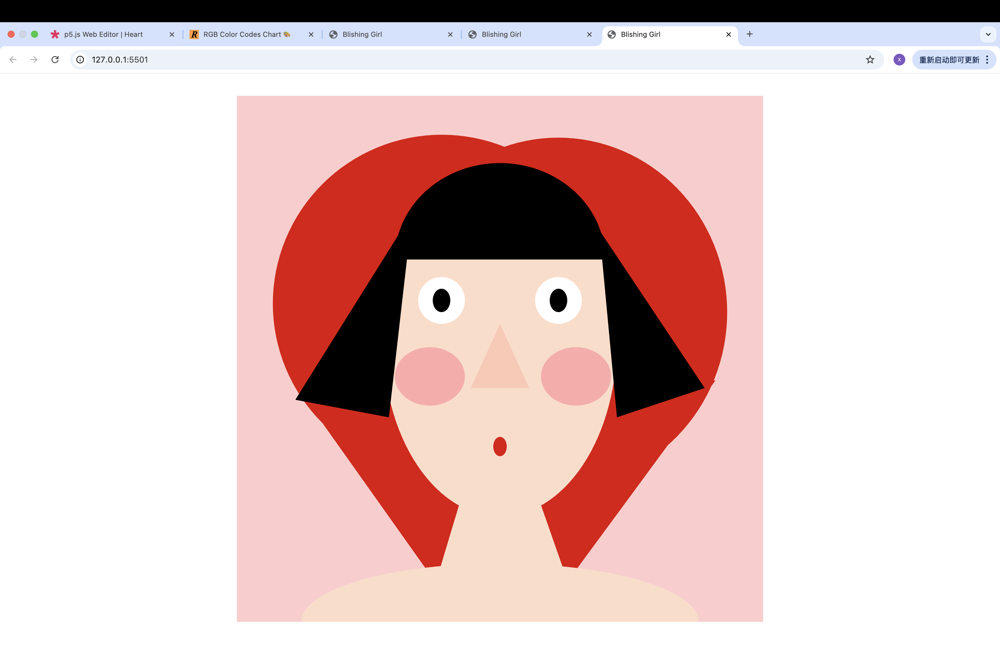

# TITLE OF PROJECT

AUTHOR NAME xueyi

[View this project online] GitHub Pages Link : https://github.com/xiaxueyi00-eng/cart253/tree/main/air-jam

## Description
This project uses p5.js to create a playful self-portrait.
 It blends experiments with newly learned functions with concepts covered in class.
 The face is constructed from simple geometric shapes (triangle, quad, ellipse, and arc), and it is adorned with a heart-shaped background..  

-	Blush
lerpColor() is used to gradually change the blush color over time.
-	Blinking eyes
A conditional (if) with frameCount makes the eyes blink every few seconds.
Inspired by the Week 3 group assignment.
-	Interactivity
The pupils follow the mouse (mouseX) to add interaction.
-	Hair
I used the arc() function for the hair, which was new to me.
-	Heart background
The heart is made of two circles and one triangle.
I used scale() with mouseWheel() for the first time to make it dynamically resize.
## Screenshot(s)

This bit should have some images of the program running so that the reader has a sense of what it looks like. 

## Attribution

This bit should attribute any code, assets or other elements used taken from other sources. For example:

> - This project uses [p5.js](https://p5js.org).
> - The Week 3 group assignment served as the inspiration for the blinking eyes (using `frameCount` with conditionals) concept.  
> - Using `scale()` and `mouseWheel()`, dynamic resizing was added to the heart shape, which was inspired by basic geometric combinations (two circles and one triangle).  

This bit should include the license you want to apply to your work. 

> This project is licensed under a Creative Commons Attribution ([CC BY 4.0](https://creativecommons.org/licenses/by/4.0/deed.en)) license with the exception of libraries and other components with their own licenses.