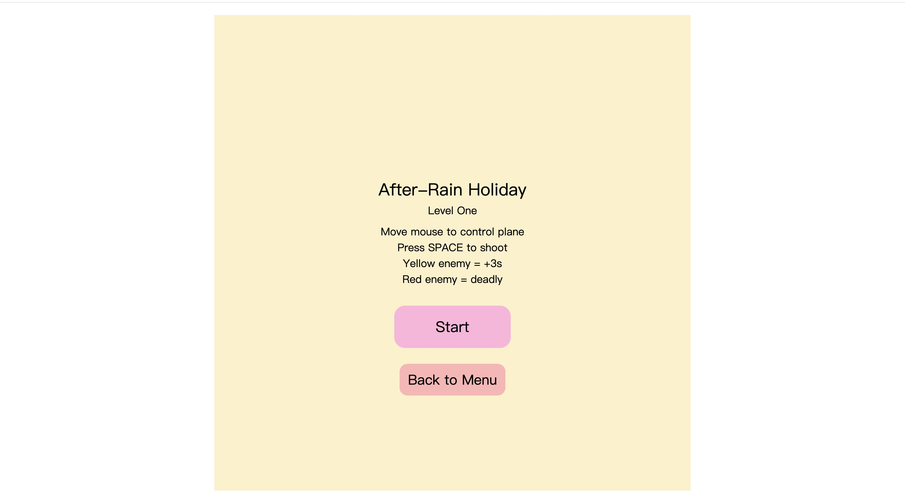
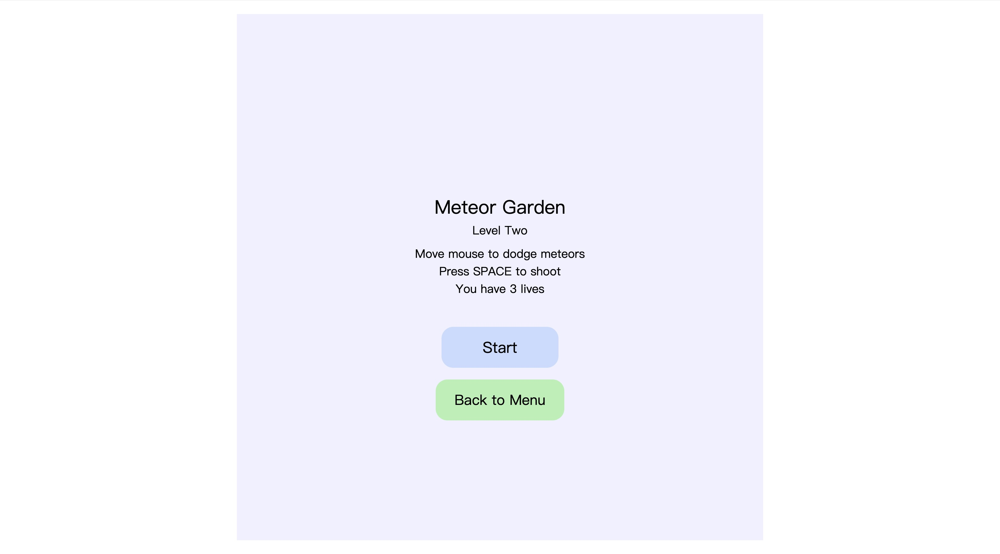
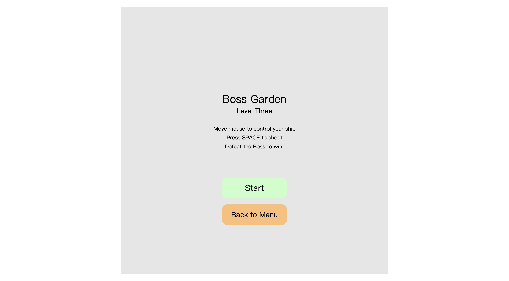

# Game Time 
Author : xueyi xia 
[View this project online](URL_FOR_THE_RUNNING_PROJECT)

## Description
Game time is a composition of the project that includes three games and three levels, and every game has a different visual style, enemy, and rules. The player can choose on the main menu.
The game is primarily controlled by moving the plane with the mouse and shooting using the space key. Each level has its own unique design.
- Game 1 : Rain day theme , player need shoot down enemies within a time limit while avoiding deadly red aircraft.
- Game 2: Space setting, have fission enemy and need be careful the meteor shot across the sky!! if you get hit by a meteor, you will lose one live.
- Game 3: I call this game “The Ultimate Nightmare", the final boss level, have different enemies (revolve, jump and sinusoidal movement) also boss that enters a rage mode.
This program's target is to make players learn through progressively escalating challenges, visual changes, and changes in pacing, from relaxed to intense and from normal shooting to boss battles, giving the entire experience a complete and cohesive gameplay rhythm.

	
## Screenshot(s)
Below are screenshots showcasing the gameplay of each stage in the project:
> 

>
>
>
The game opens with a soft cloud-opening animation that reveals the main menu, creating a warm and inviting start to the player’s experience.

## Attribution

>- General
- This project uses the p5.js library for drawing, animation, and interaction.
https://p5js.org
  - Shooting sound effects across Game 1–3:
Space Shooter – Falling Hit — Mixkit
https://mixkit.co/free-sound-effects/space-shooter/

> - Game 1 References
- Code inspiration and examples from:
-	https://editor.p5js.org/car1a/sketches/JFTZ8Tzhk
- https://editor.p5js.org/412065342/sketches/r1zDoHS3W
-	Sound effects:
-	Game Show Uplifting — Mixkit
https://mixkit.co/free-sound-effects/discover/uplifting/

> - Game 2 References
-	Code references from:
-	https://editor.p5js.org/yy5272/sketches/TpsliXOYw
-	https://editor.p5js.org/skgmmt/sketches/BkHuFzCpm
-	https://editor.p5js.org/SihanZhang/sketches/c6Yp_c_XD
-	Music:
-	Nature Yoga (Ambient Music) — Mixkit
https://mixkit.co/free-stock-music/ambient/
> - Game 3 References
- Code references from: 
https://editor.p5js.org/willgeary/sketches/B15uLDjhm
- 	Synth Suspense Music — Mixkit
https://mixkit.co/free-sound-effects/suspense-music/

## License
> This project is licensed under a Creative Commons Attribution ([CC BY 4.0](https://creativecommons.org/licenses/by/4.0/deed.en)) license with the exception of libraries and other components with their own licenses.